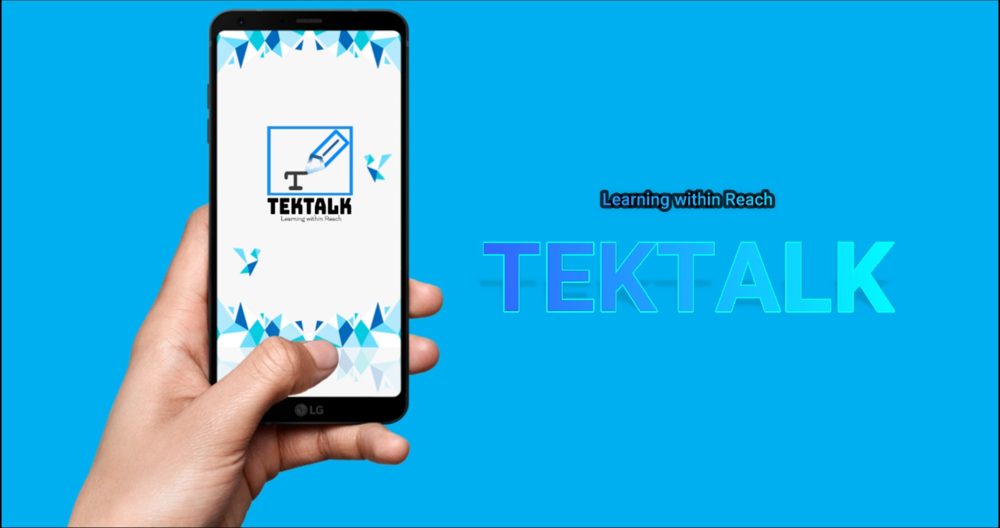

# TEKTALK

Tektalk is an application in which the user is given an opportunity to learn a new language in a more fun and interactive way by letting the learner learn from their own environment, teaching them the correct pronunciation of a language and a fun gameplay with a community. The idea was realized by mainly using the two emerging technologies Augmented Reality (AR) and Artifical Intelligence (AI)

## Interface Requirements 

1. Real time camera detecting an object 
2. Real time displaying the translated word
3. Label the object using bounding box RectF

### The following are the basic non-fundamental requirements that are needed to be satisfied for the said program: 

## Android Requirements:
The Tektalk operating system is based on the regular version of Android but it’s optimized to run on smartphones with 512 MB to 1 GB of RAM modeled and compatible from Android 8.0 "Oreo"

## How to play the game
Scan and download the APK file 

### Download the APK file

### Log in

### Learn 

### Select Language 

### Capture an Object to Learn new language

### Text to Speech in order to adapt the intonation

### Save word for bookmark

### Tektalkback

### Scoring using our speech algorithm with result using fuzzy algorithm

### Bookmark

### Game

### Result

### Leaderboard in Community

