# TEKTALK

Tektalk is an application in which the user is given an opportunity to learn a new language in a more fun and interactive way by letting the learner learn from their own environment, teaching them the correct pronunciation of a language and a fun gameplay with a community. The idea was realized by mainly using the two emerging technologies Augmented Reality (AR) and Artifical Intelligence (AI)

## Interface Requirements 

1. Real time camera detecting an object 
2. Real time displaying the translated word
3. Label the object using bounding box RectF

## Code Viewing

*Make sure to install proper NDK in your local copy of android studio
*Android Studio used: V 4.0.1
*Android API: 28

### The following are the basic non-fundamental requirements that are needed to be satisfied for the said application: 

## Android Requirements:
1. Our recommended screen aspect ratio is atleast 18:9
2. We DO NOT recommend 16:9 aspect ratio phones.
3. Application is in debug mode
4. Set phone first in developer mode
5. Recommended android version is oreo
6. Minimum android version is lollipop

## How to play the game

### Download the APK file
Scan and download the APK file 

### Log in

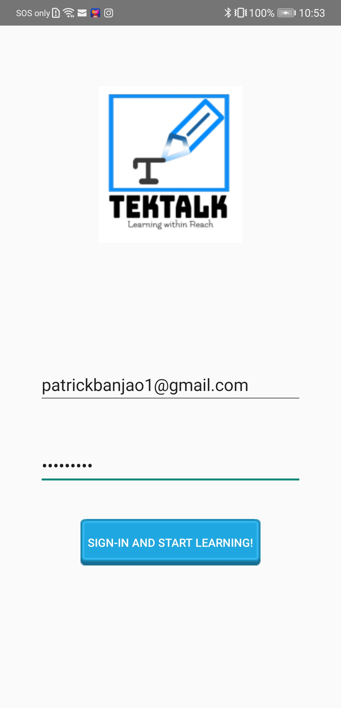 

### Main Menu

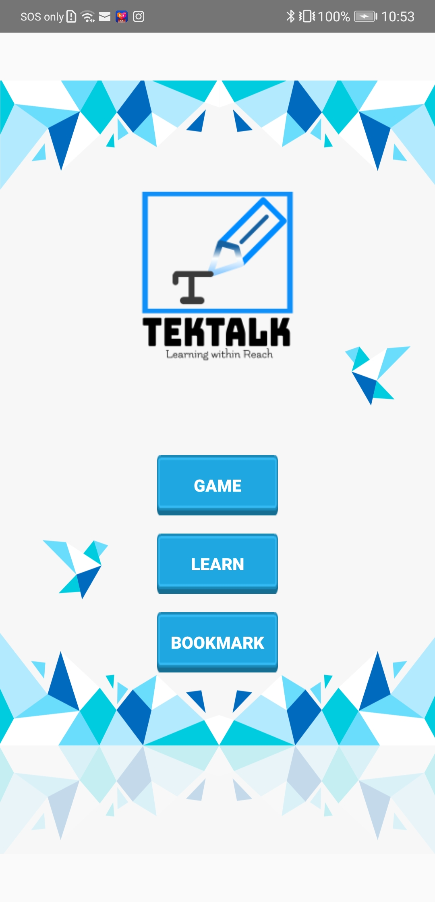

### Select Language 

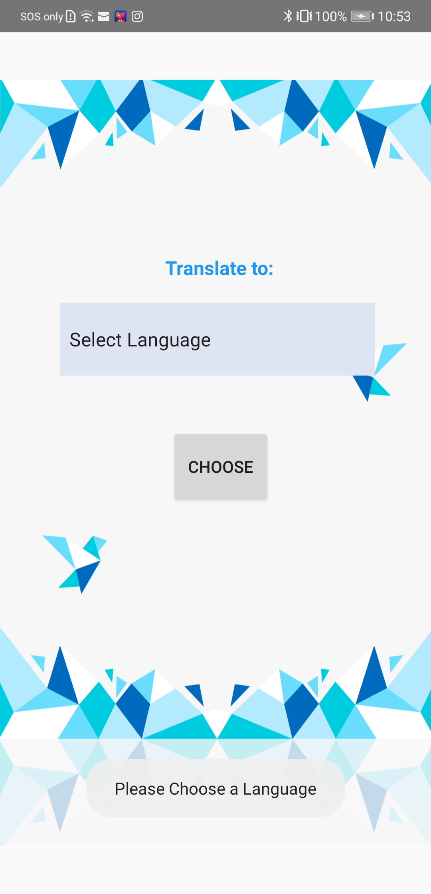 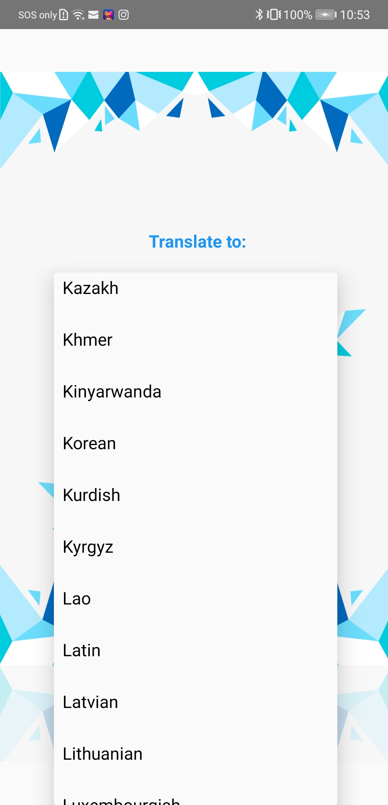 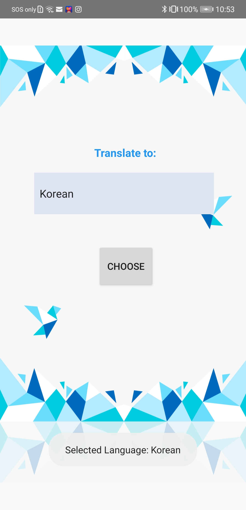

### Capture an Object to Learn new language

Click Capture for start viewing the translated word, click the volume button for text-to-speech and correct intonation used of word and save button for your bookmark.

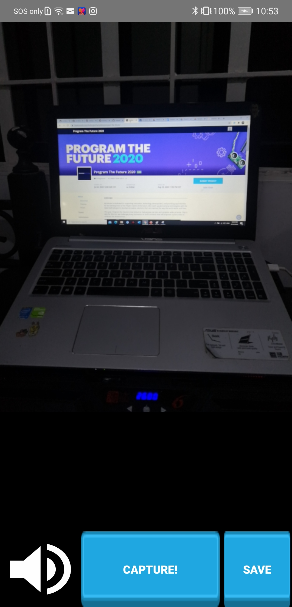 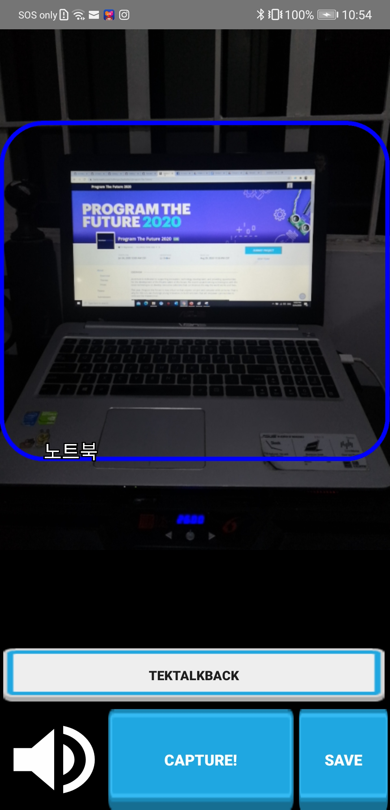

### Tektalkback

Scoring using our speech algorithm with result using fuzzy algorithm

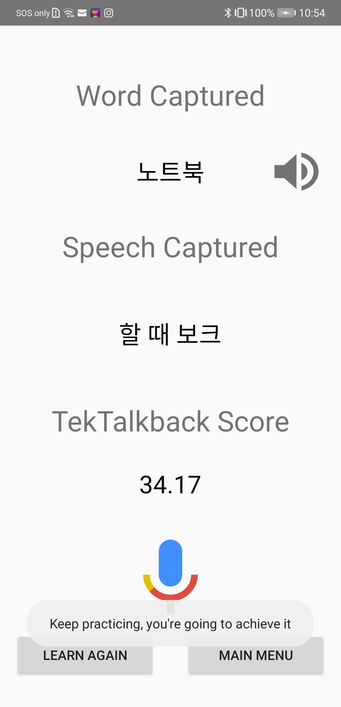

### Bookmark

Saved word displayed in the bookmark section 

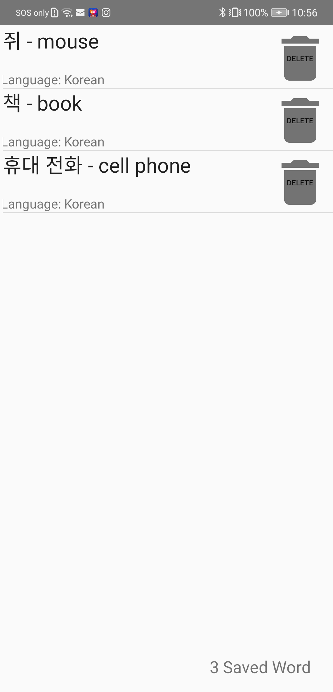

### Game

The rule of the game is to find the given translated word and determine if it is correct. If the image captured equates to that or the random word provided by our app then the score would add a point if not it remains the same and the scoring would not add another score unless the previous high score in the 60 secs time frame would be surpassed.

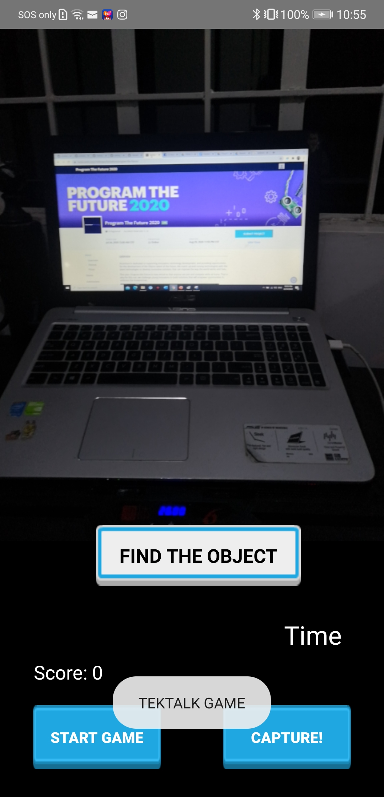 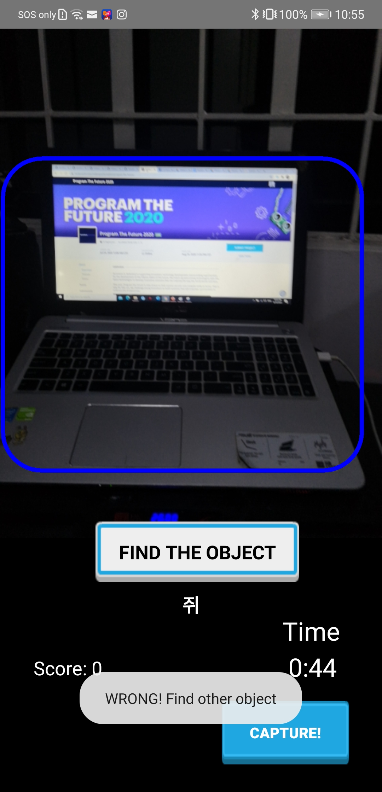  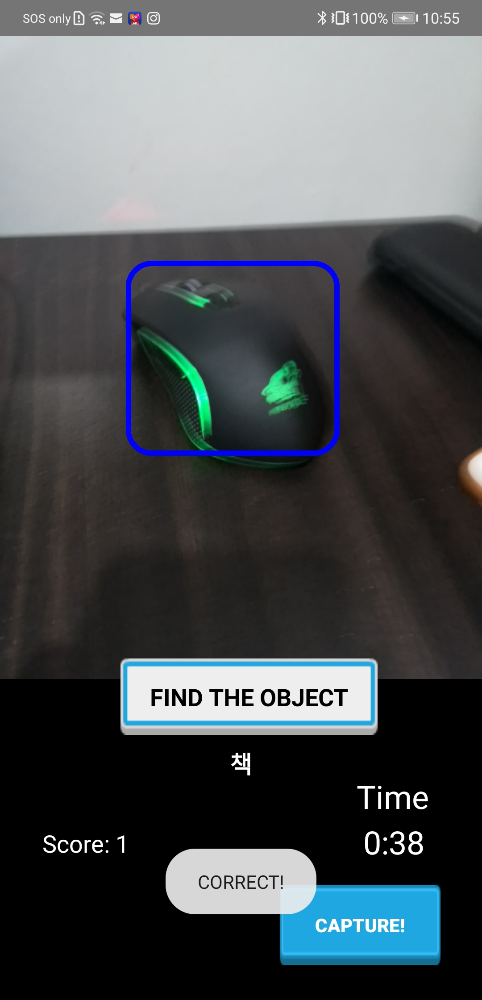 

### Result

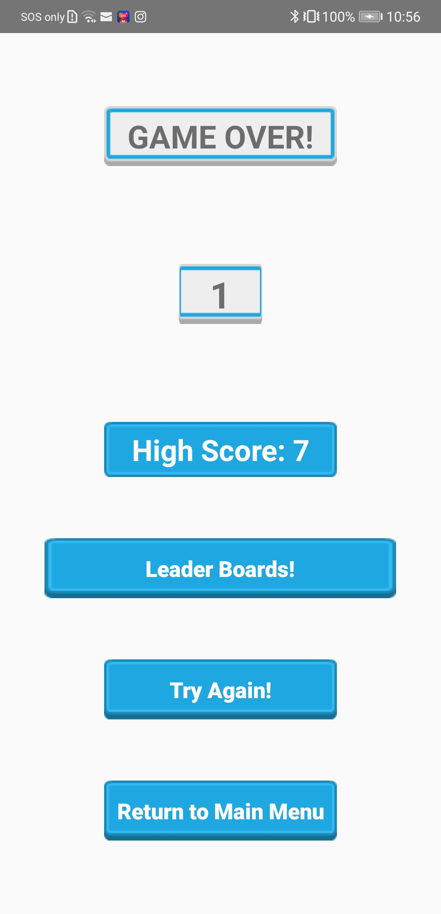

### Leaderboard in Community

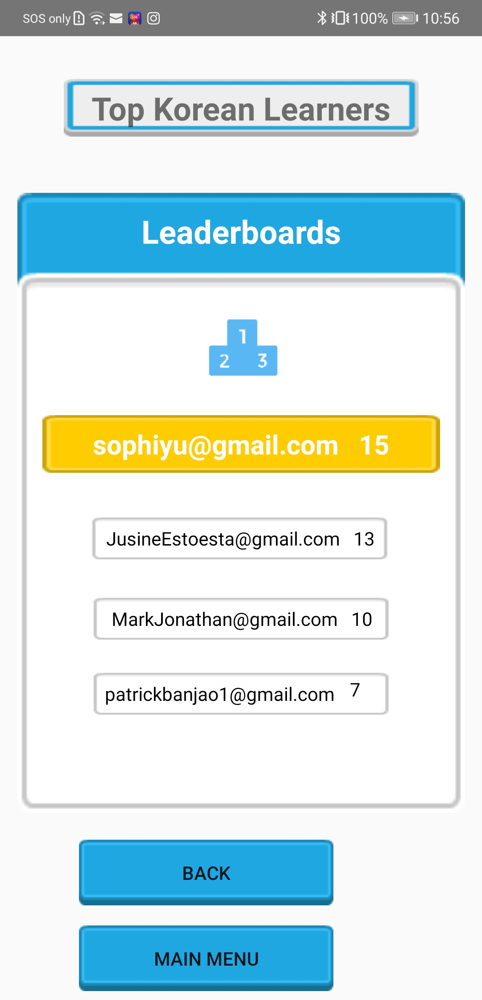

## Infomercial Video 
https://www.youtube.com/embed/OvV_Z7ulAPQ

